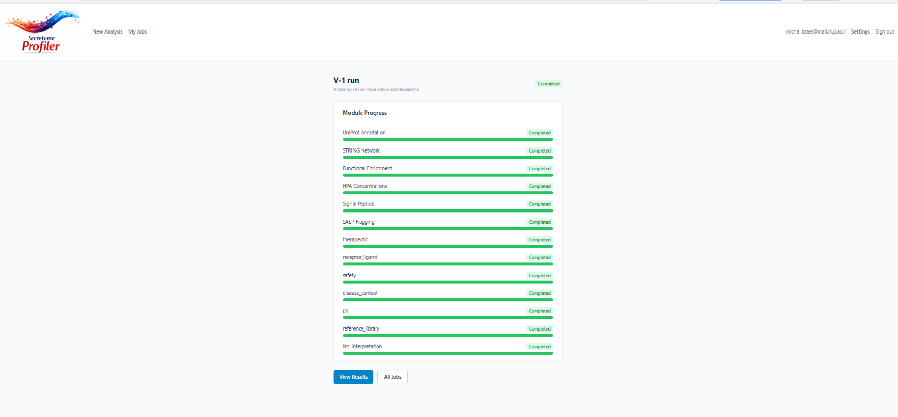
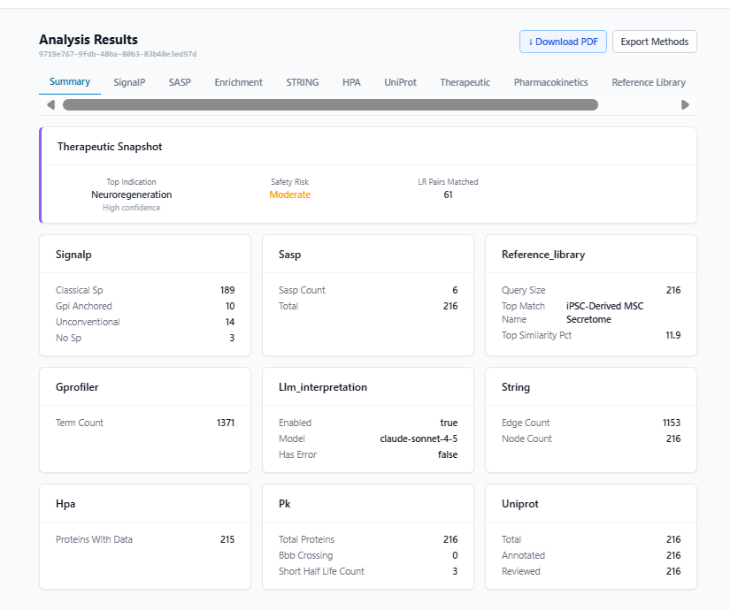
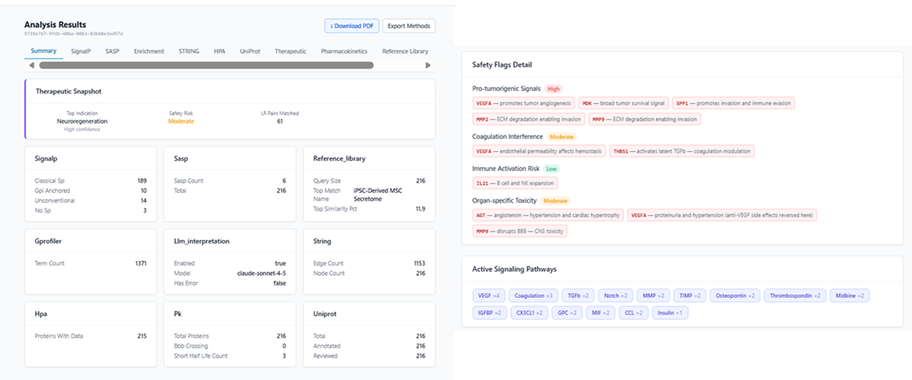
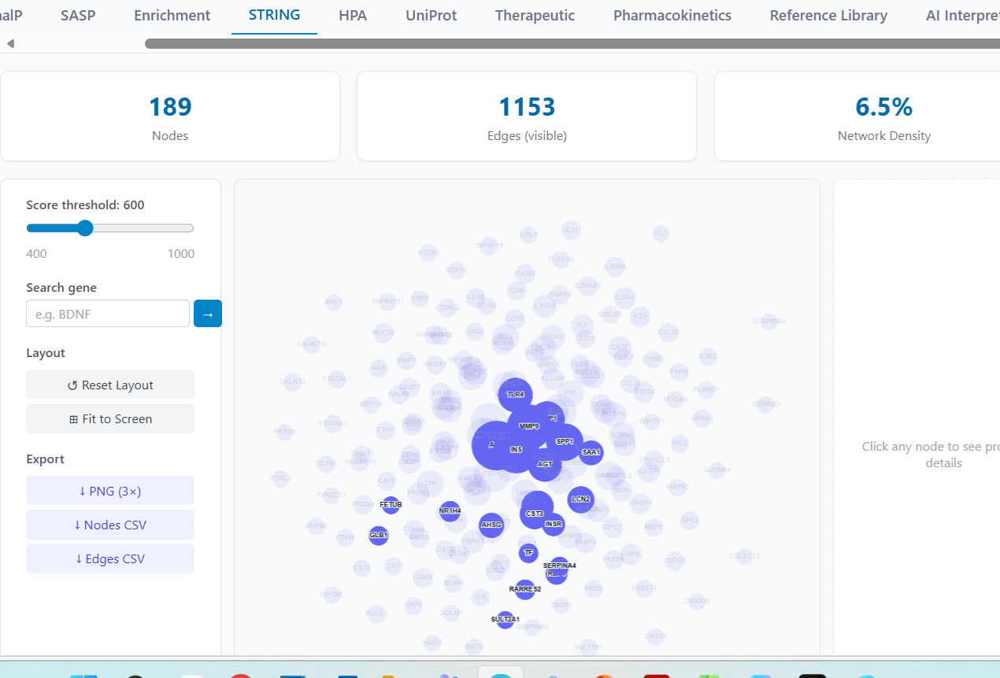
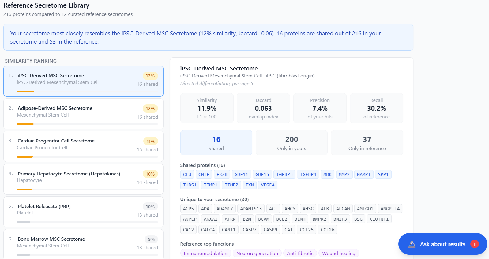
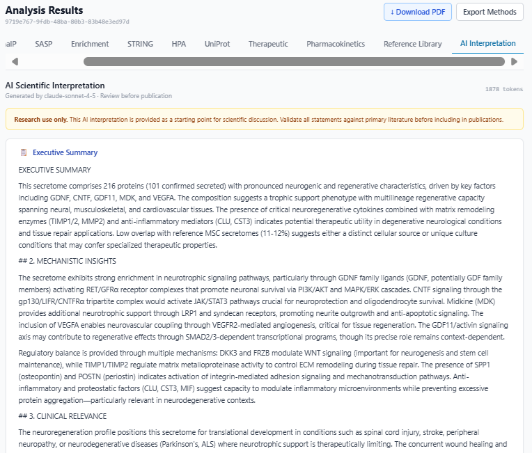
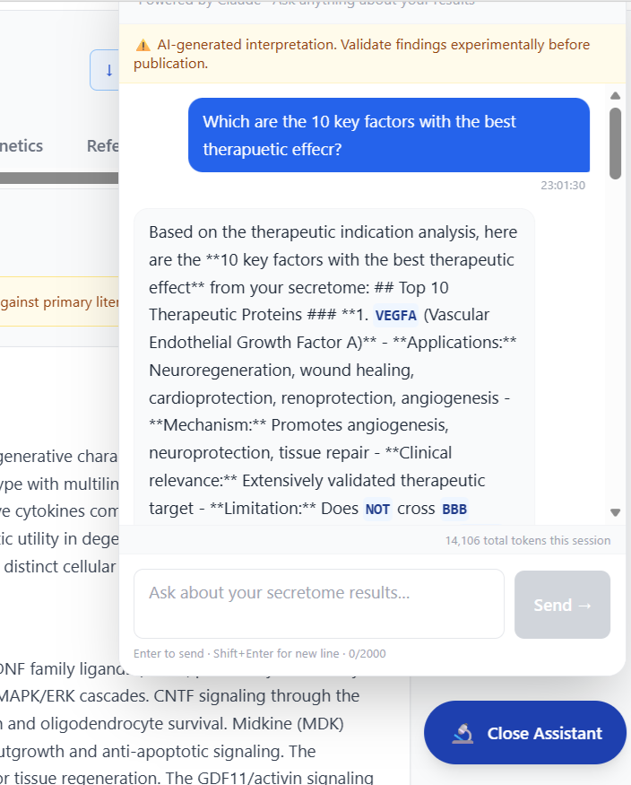

# Secretome Profiler

A full-stack bioinformatics platform for comprehensive analysis of cell secretomes. Submit a list of UniProt protein accessions and receive multi-module analysis covering protein annotations, interaction networks, pathway enrichment, secretion classification, pharmacokinetics, therapeutic potential scoring, safety profiling, quantitative concentration analysis, reference secretome comparison, and AI-generated scientific interpretation.

> 🌐 **Deployment:** Coming soon at https://app.leverage.bio (Railway — currently running locally via Docker Compose)

---

## Features

| Module | Description |
|---|---|
| **UniProt** | Protein annotations, subcellular localisation, review status |
| **SignalP** | Secretion signal classification (classical SP, GPI-anchored, unconventional) |
| **SASP** | Senescence-associated secretory phenotype gene annotation |
| **STRING** | Protein–protein interaction network (Cytoscape visualisation) |
| **Enrichment** | GO and pathway enrichment via g:Profiler |
| **HPA** | Tissue expression data from Human Protein Atlas |
| **Therapeutic** | Scoring across 10+ therapeutic indications with protein-level drivers |
| **Receptor–Ligand** | CellChat-based ligand–receptor pair matching |
| **Safety** | Multi-dimensional safety flag profiling |
| **Disease Context** | Disease-protein associations via OpenTargets/DisGeNET |
| **Pharmacokinetics** | BBB penetration, plasma half-life, molecular weight |
| **Concentrations** | Quantitative comparison vs. healthy plasma reference values |
| **Reference Library** | Jaccard/F1 similarity against 12 curated reference secretomes |
| **AI Interpretation** | 4-section scientific interpretation via Claude API |
| **Comparison mode** | Side-by-side differential analysis of two protein sets |
| **PDF Report** | Downloadable multi-section PDF with all results |
| **Methods export** | Publication-ready methods section + BibTeX citations |
| **Q&A Assistant** | Floating chat panel powered by Claude for interactive questions |

---

## Architecture

```
nginx:80
  ├── /api/*  → backend:8000  (FastAPI + Celery workers)
  └── /*      → frontend:3000 (React + Vite)

backend ──► PostgreSQL  (job metadata, results index)
         ──► Redis      (Celery task queue & results)
         ──► MinIO      (module output JSON storage)
         ──► Anthropic  (LLM interpretation & Q&A)
```

**Seven Docker services:** `postgres`, `redis`, `minio`, `backend`, `worker`, `frontend`, `nginx`

---

## Screenshots

> ⚠️ The app is currently running locally. Public deployment at app.leverage.bio is in progress. All screenshots below are from the local development version.

### Module Pipeline — All 14 modules completing



*All 14 analysis modules completing successfully: UniProt Annotation, STRING Network, Functional Enrichment, HPA Concentrations, Signal Peptide, SASP Flagging, Therapeutic Scoring, Receptor-Ligand, Safety, Disease Context, PK Analysis, Reference Library, and LLM Interpretation — in parallel and sequential phases managed by Celery.*

---

### Analysis Summary Dashboard



*Summary dashboard for a 216-protein secretome analysis. Top indication: Neuroregeneration (High confidence). Safety Risk: Moderate. 61 receptor-ligand pairs matched. All 9 module cards showing real-time results including STRING network (1,153 edges, 216 nodes), UniProt (216 reviewed proteins), and LLM interpretation enabled via Claude Sonnet 4.5.*

---

### Therapeutic Indication Scoring



*Therapeutic indication scoring across 12 categories with safety flags detail. The secretome scores highest for Neuroregeneration. Safety flags shown include Pro-tumorigenic Signals (High) for VEGFA, MDK, SPP1 and MMP2/MMP9, Coagulation Interference (Moderate), and Organ-specific Toxicity (Moderate). Active signaling pathways identified include VEGF, Coagulation, TGFb, Notch, MMP, TIMP, Osteopontin, Midkine, IGFBP, CX3CL1, GPC, MIF, CCL, and Insulin.*

---

### STRING Protein Interaction Network



*STRING protein-protein interaction network showing 189 nodes and 1,153 edges at score threshold 600, with 6.5% network density. Hub proteins include INS, SPP1, SAA1, MMP8, AGT, TF, AHSG, SERPINA4, FETUB, CST3, LCN2, GLB1, NR1H4, INSR, and SULT2A1. Interactive Cytoscape.js visualization with adjustable score threshold, gene search, and PNG/CSV export.*

---

### Reference Secretome Library Comparison



*Reference secretome comparison of 216 proteins against 12 curated published secretomes. Top match: iPSC-Derived MSC Secretome (12% similarity, Jaccard=0.06), sharing 16 proteins including CLU, CNTF, FRZB, GDF11, GDF15, IGFBP3, IGFBP4, MDK, MMP2, NAMPT, SPP1, THBS1, TIMP1, TIMP2, TXN, and VEGFA. Ranked comparison shows iPSC-MSC, Adipose MSC, Cardiac Progenitor, Hepatocyte, PRP, and Bone Marrow MSC as closest matches.*

---

### AI Scientific Interpretation



*Claude Sonnet 4.5-powered scientific interpretation report (1,878 tokens). The Executive Summary identifies this as a secretome with pronounced neurogenic and regenerative characteristics driven by GDNF, CNTF, GDF11, MDK, and VEGFA, suggesting a trophic support phenotype with multilineage regenerative capacity. Sections include Mechanistic Insights (neurotrophic signaling via PI3K/AKT and MAPK/ERK), Clinical Relevance (Parkinson's, ALS, spinal cord injury), and recommended next steps.*

---

### Interactive Q&A Research Agent



*Multi-turn AI research assistant powered by Claude API, grounded in the specific analysis results of this secretome. Shown: response to "Which are the 10 key factors with the best therapeutic effect?" — the agent identifies VEGFA as top factor with applications across Neuroregeneration, wound healing, cardioprotection, renoprotection, and angiogenesis, noting its BBB limitations. 14,106 tokens used in this session.*

---

## Quick Start

### Prerequisites

- [Docker Desktop](https://www.docker.com/products/docker-desktop/) (v24+)
- 8 GB RAM available to Docker
- An [Anthropic API key](https://console.anthropic.com/) (optional — required for AI Interpretation and Q&A)

### 1. Clone and configure

```bash
git clone <repo-url>
cd "Secretome profiler"
cp .env.example backend/.env
```

Edit `backend/.env` and set:

```env
# Required
POSTGRES_PASSWORD=your_secure_password
SECRET_KEY=your_random_secret_key

# Optional — enables AI features
ANTHROPIC_API_KEY=sk-ant-api03-...
LLM_MODEL=claude-sonnet-4-5
LLM_ENABLED=true
```

### 2. Build and start

```bash
docker compose up --build -d
```

First build takes 3–5 minutes. Subsequent starts take ~20 seconds.

### 3. Run database migrations

```bash
docker compose exec backend alembic upgrade head
```

### 4. Open the app

Navigate to **http://localhost**

---

## Usage

### Single Secretome Analysis

1. Click **New Analysis** on the home page
2. Enter UniProt accession IDs (one per line, or comma-separated), e.g.:
   ```
   P01375, P05107, P60709, P00533
   ```
3. Optionally enter protein concentrations (pg/mL) for quantitative analysis
4. Click **Run Analysis** — progress is tracked in real time
5. View results across the tab bar: Summary → UniProt → ... → Reference Library → AI Interpretation

### Comparison Analysis

1. Click **Compare Two Secretomes**
2. Enter Set A and Set B protein lists with labels
3. Results show per-set analysis plus a Differential tab

### API Access

The REST API is available at `http://localhost/api/v1`. Interactive docs at `http://localhost/api/v1/docs`.

```bash
# Submit a job
curl -X POST http://localhost/api/v1/jobs/ \
  -H "Content-Type: application/json" \
  -d '{"proteins": ["P01375","P05107","P00533"], "label": "My secretome"}'

# Poll status
curl http://localhost/api/v1/jobs/<job_id>

# Get results
curl http://localhost/api/v1/results/job/<job_id>

# Download PDF
curl http://localhost/api/v1/results/job/<job_id>/report.pdf -o report.pdf
```

---

## Project Structure

```
Secretome profiler/
├── docker-compose.yml          # Service orchestration
├── nginx.conf                  # Reverse proxy routing
├── backend/
│   ├── Dockerfile
│   ├── requirements.txt
│   ├── alembic/                # Database migrations
│   └── app/
│       ├── main.py             # FastAPI application
│       ├── config.py           # Settings (pydantic-settings)
│       ├── database.py         # SQLAlchemy async engines
│       ├── models/             # SQLAlchemy ORM models
│       ├── schemas/            # Pydantic request/response models
│       ├── api/
│       │   └── endpoints/      # jobs, results, conversations, websocket
│       ├── services/           # 21 analysis + auxiliary services
│       ├── workers/            # Celery task definitions
│       └── data/               # Static reference datasets
└── frontend/
    ├── Dockerfile
    ├── package.json
    └── src/
        ├── api/                # Axios API clients
        ├── components/
│       │   ├── results/        # Per-module display components
│       │   └── ui/             # Reusable UI primitives
        ├── pages/              # Route-level page components
        ├── store/              # Zustand state management
        └── types/              # TypeScript type definitions
```

---

## Reference Secretome Library

The comparison module includes 12 curated reference secretomes from published literature:

| ID | Cell/Tissue Type | Proteins |
|---|---|---|
| msc_bone_marrow | Bone Marrow MSC | 61 |
| msc_adipose | Adipose-Derived MSC | 56 |
| msc_hypoxia | Hypoxia-Preconditioned MSC | 53 |
| ipsc_derived_msc | iPSC-Derived MSC | 53 |
| neural_stem_cell | Neural Stem Cell | 49 |
| cardiac_progenitor | Cardiac Progenitor Cell | 51 |
| skeletal_muscle_secretome | Exercised Skeletal Muscle (Myokines) | 42 |
| liver_hepatocyte | Primary Hepatocyte (Hepatokines) | 56 |
| adipocyte_white | White Adipocyte (Adipokines) | 48 |
| macrophage_m2 | M2-Polarized Macrophage | 53 |
| platelet_releasate | Platelet Releasate (PRP) | 58 |
| endothelial_shear | Shear-Stressed Endothelial Cell | 44 |

Similarity is computed as Jaccard index, precision, recall, and F1 score (F1 × 100 = similarity %).

---

## Environment Variables

| Variable | Default | Description |
|---|---|---|
| `POSTGRES_USER` | secretome | PostgreSQL username |
| `POSTGRES_PASSWORD` | — | PostgreSQL password (required) |
| `POSTGRES_DB` | secretome_db | Database name |
| `REDIS_URL` | redis://redis:6379/0 | Redis connection URL |
| `MINIO_ENDPOINT` | minio:9000 | MinIO endpoint |
| `MINIO_ROOT_USER` | minioadmin | MinIO access key |
| `MINIO_ROOT_PASSWORD` | minioadmin123 | MinIO secret key |
| `MINIO_BUCKET` | secretome-results | Storage bucket |
| `SECRET_KEY` | — | FastAPI secret key (required) |
| `ALLOWED_ORIGINS` | http://localhost:80,... | CORS allowed origins |
| `ANTHROPIC_API_KEY` | — | Claude API key (optional) |
| `LLM_MODEL` | claude-sonnet-4-5 | Anthropic model name |
| `LLM_ENABLED` | false | Enable AI features |
| `HTTP_TIMEOUT` | 30 | External API timeout (seconds) |
| `HTTP_MAX_RETRIES` | 3 | External API retry count |

---

## Tech Stack

**Backend:** Python 3.11 · FastAPI · SQLAlchemy (async) · Celery · Alembic · Pydantic v2 · httpx · anthropic SDK · reportlab · NumPy · pandas · scikit-learn

**Frontend:** React 18 · TypeScript · Vite · Tailwind CSS · TanStack Query · Zustand · Plotly · Cytoscape.js · ECharts · React Router v6

**Infrastructure:** PostgreSQL 15 · Redis 7 · MinIO · nginx · Docker Compose

---

## Development

### Viewing logs

```bash
docker compose logs backend -f
docker compose logs worker -f
docker compose logs frontend -f
```

### Running backend tests

```bash
docker compose exec backend pytest
```

### Rebuilding a single service

```bash
docker compose up --build backend -d
docker compose restart worker
```

### Accessing MinIO console

Navigate to **http://localhost:9001** (admin credentials in `.env`)

### Database shell

```bash
docker compose exec postgres psql -U secretome -d secretome_db
```

---

## AI Components

SecretomeProfiler integrates Claude at two levels:

| Component | Type | Description |
|---|---|---|
| **Q&A Research Agent** | Multi-turn conversational agent | Grounded in 14 module outputs; maintains conversation state; generates context-specific suggested questions from actual findings |
| **Scientific Report Generator** | Single structured LLM call | 10-section scientific report (executive summary through recommended next steps); generated once per job at pipeline completion |

Both components use `claude-sonnet-4-5` via the Anthropic SDK. Context fed to the Q&A agent is ~15,000–25,000 tokens (all module outputs). Context fed to the report generator is ~2,000–8,000 tokens (compressed summary).

> **Demonstrated in screenshots:** The screenshots above show a real analysis of a 216-protein neurogenic secretome. The AI Interpretation tab shows a Claude-generated report identifying the secretome as having pronounced neurogenic characteristics driven by GDNF, CNTF, GDF11, MDK, and VEGFA. The Q&A agent correctly identified VEGFA as the top therapeutic factor and accurately noted its BBB limitation — demonstrating grounded, data-specific responses rather than generic answers.

See [docs/AI_COMPONENTS.md](docs/AI_COMPONENTS.md) for full technical reference including agent classification rationale, prompt engineering decisions, and per-user API key architecture.

---

## Disclaimer

All analyses are computational predictions based on curated databases and literature-derived gene sets. Results should be validated experimentally before clinical or therapeutic application. AI-generated interpretations are provided as a starting point for scientific discussion and must be reviewed by qualified researchers before use in publications.
